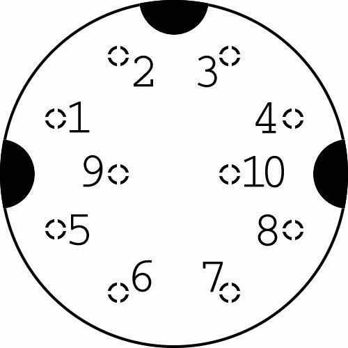

# Introduction
Nikon F90/N90 and F90X/N90s cameras can be connected to a computer to modify
settings and download some exif-like shooting data. Perhaps this qualifies
these cameras to be one of the first "smart" cameras, if nowadays we use the
word "smart" for devices that let you change the settings from a smart phone.

The interface allows setting some additional settings that are normally not
possible to set from the camera such as:
- Enabling the beeper on F90X
- Bracketing and sequence shooting (without the MF-26 back)
- Enabling imprinting on the film leader on frame "0"
- Making the shutter button act as a toggle switch in bulb mode
- Adding customized programs for program mode

As of 2024, these cameras are now old enough to have lower back issues and are
starting to accept the fact that they will never own a home or retire. My F90
which works fine otherwise has a malfunctioning viewfinder display. It makes it
impossible to use it in manual mode.

A working camera that has dead LCDs can be continued to be used without any
physical repair, if one would install a serial to bluetooth adapter on the
camera and use a smart phone to control it. That's why I think it would be
important to document the interface.

**Note:** I have compiled this information as a hobby project, and it might
have mistakes. I take no responsibility for any possible personal or device
damages. The information provided here is only meant for entertainment, and
should not be followed as instructions.

## Existing solutions
For consumer use there were mainly two systems available from Nikon. First is
the "Nikon Data Link System" (AC-1E and AC-2E), connecting the camera to a
Sharp electronic organizer. The other one is the "Nikon Photo Secretary"
(AC-PW-E)[^1] software for PCs.

There were also several third party solutions:
- gIcon (For PC, open source) [^2][^3]
- N90 Buddy (For Palm pocket computers, open source) [^4][^5]
- OptN90s [^6]
- SoftTALK [^7]
- Meta35 (More recent; 2010s) [^8]

# Hardware
The camera can be connected using the 10-pin connector on the front.
Originally, MC-27 cable was used for the Data Link system, and MC-31/MC-33 for
the Photo Secretary.

## Pinout


Above image is taken from the
[gIcon project](https://web.archive.org/web/20040415102030/http://www.k-i-s.net/sw/po/demo/photo.php?photo=22)
and represents the pins when looking at the **cable**.

| Pin # | Description           |
| ---   | ---                   |
| 1     | Serial RX             |
| 2     | Battery voltage       |
| 3     | Regulated +5V         |
| 4     | Shutter fully pressed |
| 5     | Unknown               |
| 6     | Signal ground         |
| 7     | Power ground          |
| 8     | Serial TX             |
| 9     | Shutter half pressed  |
| 10    | Unknown               |

The serial voltage is 5 volts. The regulated +5V (#3) is only available when
the camera is on. It can be used as a reference voltage for the serial
communication.

The signal ground is used with the serial RX/TX, as well as shutter release
pins (#4 and #9).

The battery voltage (#2) is available also when the camera is turned off. It
might be possible to power a low power bluetooth chip with it. The user manual
of the Nikon ML-3 wireless remote control mentions to detach the cord from the
camera to conserve battery power. That might mean that it is using the pin #2
to power itself up.

The unknown pins are most likely related to signaling when connecting multiple
cameras together.

## Building a cable
The original cables are hard to find, and even so, most modern computers don't
have the RS232 port that the MC-33 cable can connect to.

For finding a suitable connector to the camera, safest bet would be to use a
cord which is guaranteed to have all the 10 wires. Such cables can be MC-21 or
MC-37. The problem with MC-37 is that when attached on the camera, the cable
faces the lens so it is not possible to use it when the camera has a lens
attached.

Once a suitable cable is found, you can cut it and crimp two RJ45 connectors to
it. You can also use RJ50 if you want to keep all the pins.

I have been using an Arduino Uno R3 as a USB to serial adapter. The Arduino is
easy to find, and also has 5 volt serial. The Arduino can be used as an adapter
by connecting the reset pin to ground. Then you can connect the TX, RX and the
ground pins from the camera.

More information on how to build a cable can be found from
[here](https://web.archive.org/web/20031118204026/http://www.k-i-s.net/article.php?article=20).

# Serial communication
## Sessions
Every operation should be done in a session. A session starts with a unit
inquiry command, and lasts until the camera goes to sleep. A wakeup command
should be sent in order to wake up the camera before starting a session. The
default BAUD rate is 1200.

An example session:
```
PC  -> Cam: 00                                              # The wakeup command
Cam -> PC : 15 83                                           # Only if the camera was awake. No response if it was asleep.
PC  -> Cam: 53 31 30 30 30 05                               # The unit inquiry command (S1000[ENQ])
Cam -> PC : 31 30 32 30 46 39 30 58 2F 4E 39 30 53 00 03 06 # (1020F90X/N90S[NUL][ETX][ACK])
``````

### 9600 BAUD Session
A session can be upgraded to have 9600 BAUD for faster communication. This is
usually used for reading the shooting data. After starting a normal session, a
request to change the baud rate is made. The client then should wait 200
milliseconds before continuing communication. The 9600 baud session can be
terminated with a message.

(TODO should check when is the termination actually needed)

Example (after starting a normal session):
```
PC  -> Cam: 01 20 87 05 00 00 00 00 03 # Special command to change baud rate
Cam -> PC : 06 00 # ([ACK][NUL])
```

## Memory spaces
When reading or writing to the memory, most likely there are different address
spaces. The default one is 00. It is possible to adjust camera settings, read
some values about the camera status etc. from there.

Then there is the memory space 01, reading from here is a little bit slower
compared to 00. The shooting data is stored under this space as well. The usual
write command does not work here.

Most likely the space 01 is some kind of a protected (read-only) way to
directly access the EEPROM (the non-volatile memory), while the space 00
accesses the volatile memory.

EEPROMs have a limited life, so it would make sense that the camera would not
write to it each time you change a setting. Instead it might be updating it
based on the volatile memory when putting the camera off or when it goes to
sleep. This can be confirmed by changing a camera setting, and removing the
batteries before the camera goes to sleep. The updated setting is not saved
when the batteries are placed back.

The EEPROM also holds various calibration data that is unique for a given unit.
There is also a parameter to control leaving the film leader out. Writing to
the EEPROM can be risky, and I don't know how to do that anyway. It is outside
of the scope of this documentation.

## Data packet
When reading memory values, the camera responds with data packets. When writing
to the memory, the new values are also sent as a data packet.

A data packet looks like the following:
```
02
(Payload, N bytes)
(Checksum, 1 byte. Mod 0xFF of the sum of all payload bytes)
03
```

## Reading a value
Reads the bytes from the memory. The command looks like the following:

```
01
20
80
(Memory space to read from, 1 byte)
(Address to read, 2 bytes)
00
(Length, 1 byte)
03
```

The camera then responds with a data packet.

## Writing a value
Write given bytes to the memory. The command looks like the following:

```
01
20
81
(Memory space, 1 byte. Probably only 00 is allowed by default.)
(Address, 2 bytes)
00
(Payload length, 1 byte)
(Data packet, payload length + 3 bytes)
```

After receiving the command, the camera responds with `06 00` ([ACK][NUL]).
Some memory locations are read-only, such as metering value. When trying to
write to these locations, the camera still sends the same response even though
it is not updated.

## Special commands

### Focus
Triggers autofocus. Similar to half-depressing the shutter button.

```01 20 86 00 00 00 00 00 03```

### Shutter release
Similar to fully pressing the shutter button. Triggers the shutter release when
in manual or continuous servo autofocus modes. When used with the single servo
autofocus mode, might trigger autofocus and not release the shutter if not in
focus. The behavior might be possible to change, see the notes for Data Link
System in the cameras user manual.

```01 20 85 00 00 00 00 00 03```

## Communicating with the MF-26 back
TODO

# Reading shooting data ("EXIF")
TODO

# Memory map
TODO
## List of memory addresses
| Address           | Size (bytes) | Short description                   |
| ---               | ---          | ---                                 |
| [0xFD21](#0xfd21) | 1            | Frame number                        |
| [0xFD22](#0xfd22) | 2            | Total frames shot ("shutter count") |
| [0xFD25](#0xfd25) | 1            | Shutter speed                       |
| [0xFE20](#0xfe20) | 1            | Focus flags?                        |
| [0xFE21](#0xfe21) | 1            | Lens flags?                         |
| [0xFE22](#0xfe22) | 1            | Focus flags?                        |

## Descriptions of memory addresses

### 0xFD21
Frame number of the current film.

<details>
<summary>Details</summary>
  
| Value        | Frame number |
| ---          | ---          |
| 0x00         | No film      |
| 0x01         | Frame 0      |
| 0x02         | Frame 1      |
| And so on... | ...          |
</details>

### 0xFD22
Total frames shot. Also counts empty shots when there was no film installed.
Little endian.
<details>
<summary>Example</summary>
For 2001 frames, the values would be:

| Address | Value |
| ---     | ---   |
| 0xFD22  | 0xD1  |
| 0xFD23  | 0x07  |
</details>

### 0xFD25
Shutter speed setting in the manual mode. Setting to unknown values (0x01,
0x02) disables the manual shutter speed selection on the camera. They might be
some special mode, haven't investigated further.

<details>
<summary>Details</summary>

| Value | Shutter speed setting |
| ---   | ---                   |
| 0x00  | Bulb                  |
| 0x01  | (Unknown)             |
| 0x02  | (Unknown)             |
| 0x03  | 30"                   |
| 0x04  | 25"                   |
| 0x05  | 20"                   |
| 0x06  | 15"                   |
| 0x07  | 13"                   |
| 0x08  | 10"                   |
| 0x09  | 8"                    |
| 0x0A  | 6"                    |
| 0x0B  | 5"                    |
| 0x0C  | 4"                    |
| 0x0D  | 3"                    |
| 0x0E  | 2.5"                  |
| 0x0F  | 2"                    |
| 0x10  | 1.6"                  |
| 0x11  | 1.3"                  |
| 0x12  | 1"                    |
| 0x13  | 1/1.3                 |
| 0x14  | 1/1.6                 |
| 0x15  | 1/2                   |
| 0x16  | 1/2.5                 |
| 0x17  | 1/3                   |
| 0x18  | 1/4                   |
| 0x19  | 1/5                   |
| 0x1A  | 1/6                   |
| 0x1B  | 1/8                   |
| 0x1C  | 1/10                  |
| 0x1D  | 1/13                  |
| 0x1E  | 1/15                  |
| 0x1F  | 1/20                  |
| 0x20  | 1/25                  |
| 0x21  | 1/30                  |
| 0x22  | 1/40                  |
| 0x23  | 1/50                  |
| 0x24  | 1/60                  |
| 0x25  | 1/80                  |
| 0x26  | 1/100                 |
| 0x27  | 1/125                 |
| 0x28  | 1/160                 |
| 0x29  | 1/200                 |
| 0x2A  | 1/250                 |
| 0x2B  | 1/320                 |
| 0x2C  | 1/400                 |
| 0x2D  | 1/500                 |
| 0x2E  | 1/640                 |
| 0x2F  | 1/800                 |
| 0x30  | 1/1000                |
| 0x31  | 1/1250                |
| 0x32  | 1/1600                |
| 0x33  | 1/2000                |
| 0x34  | 1/2500                |
| 0x35  | 1/3200                |
| 0x36  | 1/4000                |
| 0x37  | 1/5000                |
| 0x38  | 1/6400                |
| 0x39  | 1/8000                |
</details>

### 0xFE20
Holds some possible flags, not all are known and known ones are not certain.

<details>
<summary>Details</summary>

| Bit  | Description                                       |
| ---  | ---                                               |
| 0x20 | Autofocus available                               |
| 0x40 | Single Servo AF enabled, shutter might be blocked |
</details>

### 0xFE21
Holds some possible flags, not all are known and known ones are not certain.

<details>
<summary>Details</summary>

| Bit  | Description                    |
| ---  | ---                            |
| 0x02 | Aperture information available |
</details>

### 0xFE22
Holds some possible flags, not all are known and known ones are not certain.

<details>
<summary>Details</summary>

| Bit  | Description                                       |
| ---  | ---                                               |
| 0x40 | Manual focusing information available             |
| 0x01 | Subject too close                                 |
| 0x02 | Subject in focus                                  |
| 0x04 | Subject too far                                   |
| 0x08 | Autofocus error; not enough light?                |
| 0x80 | Single Servo AF enabled, shutter might be blocked |
</details>

# References
[^1]: [AC-PW-E](https://web.archive.org/web/20001016003317/http://www.nikon.co.jp/main/eng/news/may01_97.htm)
[^2]: [gIcon](https://web.archive.org/web/20031118204714/http://www.k-i-s.net/article.php?article=4)
[^3]: [gIcon source](https://archive.org/details/gicon-0.1.2)
[^4]: [N90 Buddy](https://web.archive.org/web/20040828080938/http://members.aol.com/khancock/pilot/nbuddy/N90Buddy.html)
[^5]: [N90 Buddy source](https://archive.org/details/n-90-buddy-for-palm-source)
[^6]: [OptN90s](https://web.archive.org/web/20070623073418/http://web.mit.edu/cai/www/nikon/optn90s.html)
[^7]: [SoftTALK](https://www.cocoon-creations.com/COCOON-NiCommSoftTALK-98.shtml)
[^8]: [Meta35](https://www.filmshooterscollective.com/analog-film-photography-blog/meta35-review-2015)
[^9]: [10 pin connector pinout](https://pinoutguide.com/DigitalCameras/nikon_d200_shutter_pinout.shtml)

